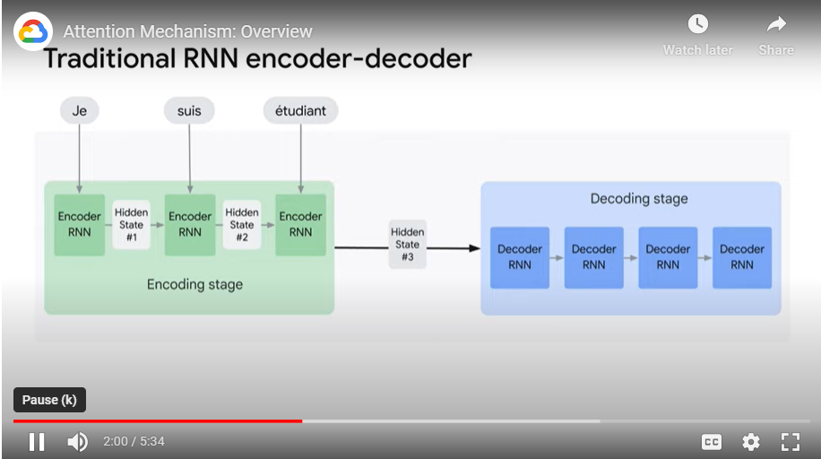
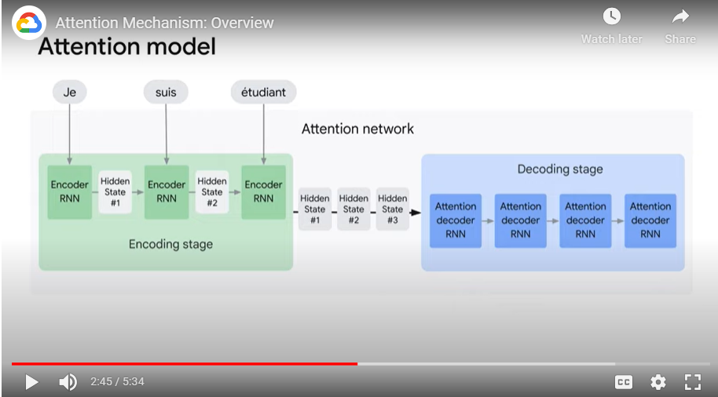

# Notes

## About
- Lector: Sanjana Reddy, Machine Learning Engineer, Advanced Solutions Lab, Google Cloud
- Objective: give you a solid footing on some of the underlying concepts that make all the Gen AI magic possible.

## Attention Mechanism
- Is behind all the transformer models
- Os core to the LLM models.
- Attention mechanism is a technique that allows the neural network to focus on specific parts of an input sequence.
    - This is done by assigning weights to different parts of the input sequence with the most important parts receiving the highest weights.

## Traditional RNN vs NN with Attention
- x2 differences:
    - With attention, encoder passes a lot more data to a decoder
        - Instead of just passing the final hidden state to the decoder, the encoder passes all the hidden states from each time step.
        - This gives the decoder more context beyond just the final hidden state.
    - There is an extra step to the attention decoder before producing its output
- 
- 
