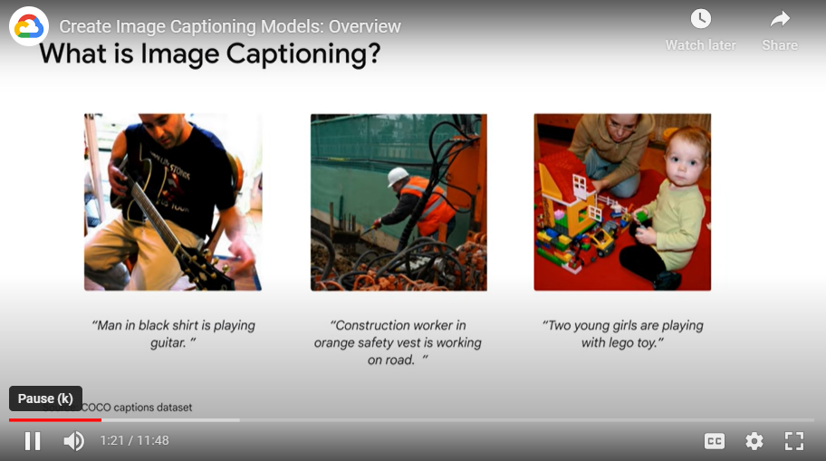
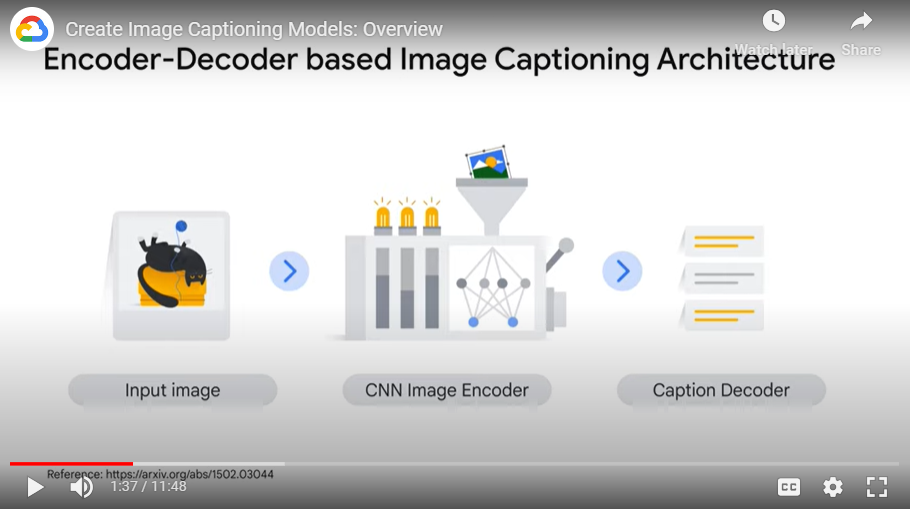
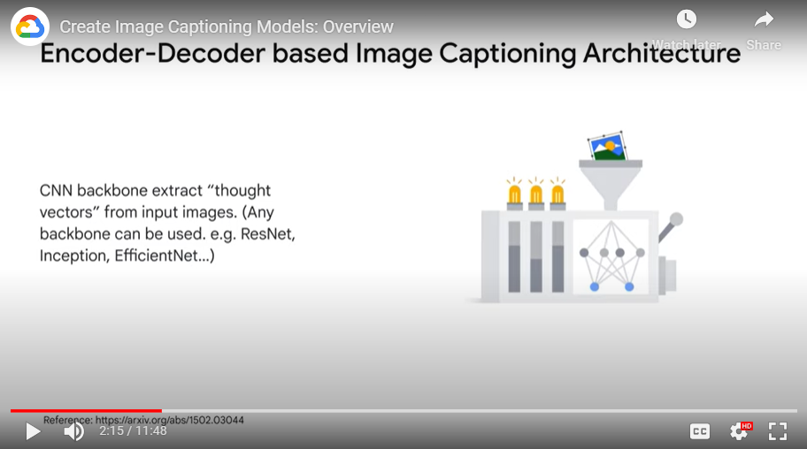
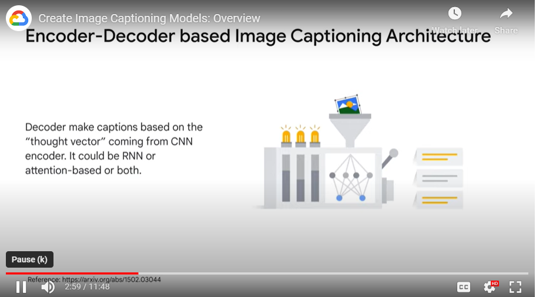
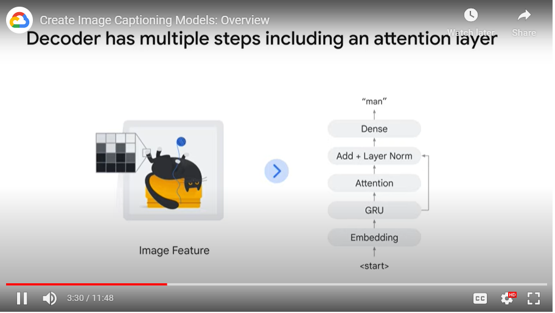
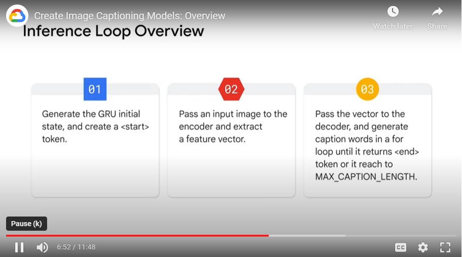
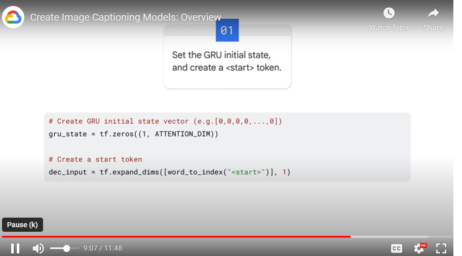
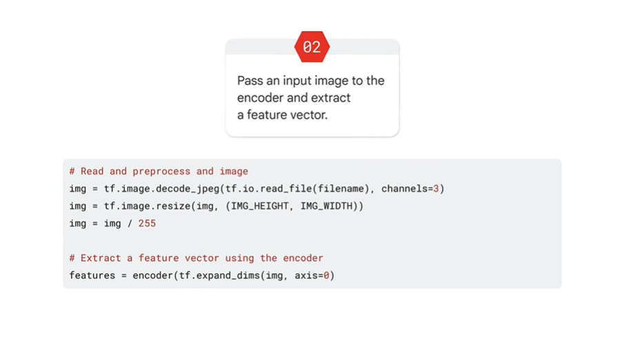
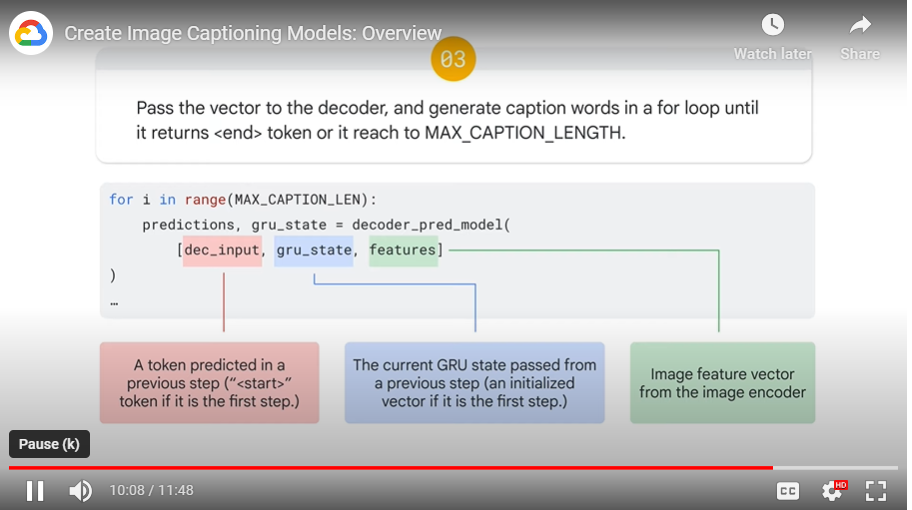

# Notes

## About
- Lector: Takumi Ohyama, Machine Learning Engineer, Advanced Solutions Lab, Google Cloud
- Contents of the course:
    - explain what kind of technology has walking behind generative AIs
    - how to actually create a very simple generative model, image captioning model, by using a technologies like encoder-decoder, attention mechanism, and a bit transformers

## Image captioning task
- Task: having a pairs of images and text data, build and train a model that can generate these kind of takes captions based on images
- 

## Architecture for solution
- 
- It is kind of encoder decoder model
- But in this case, encode and decoder handle different modality of data, which is image and text

## Encoder part
- 

## Decoder part
- 
- 

## Inference loop
- 
    - 
    - 
    - 
