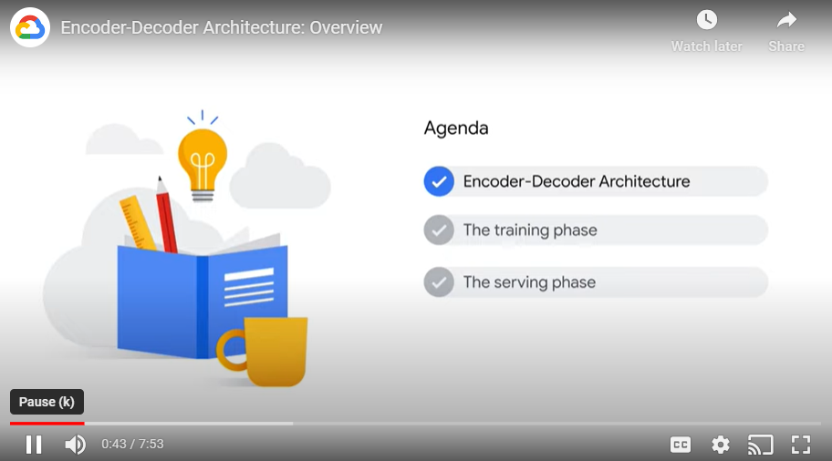
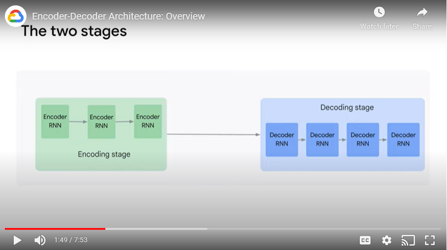
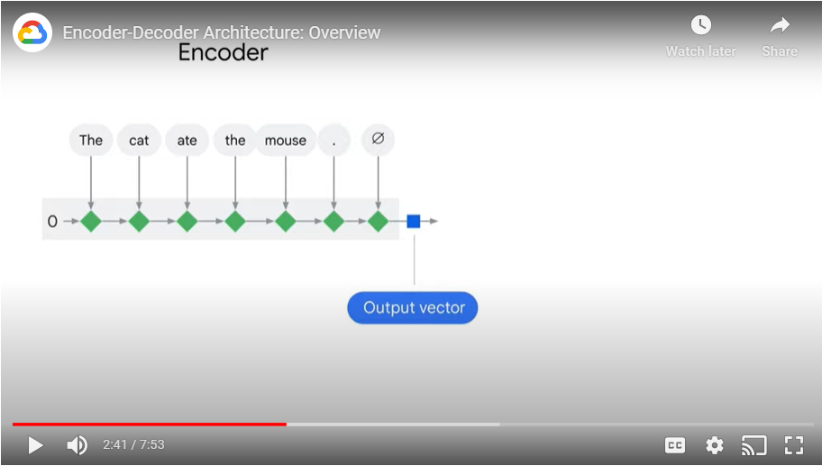
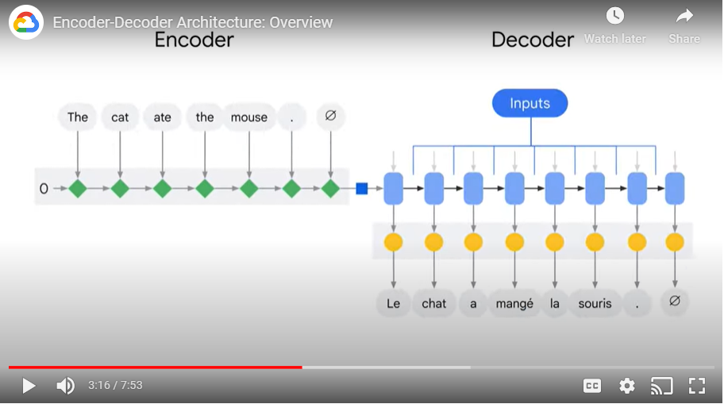
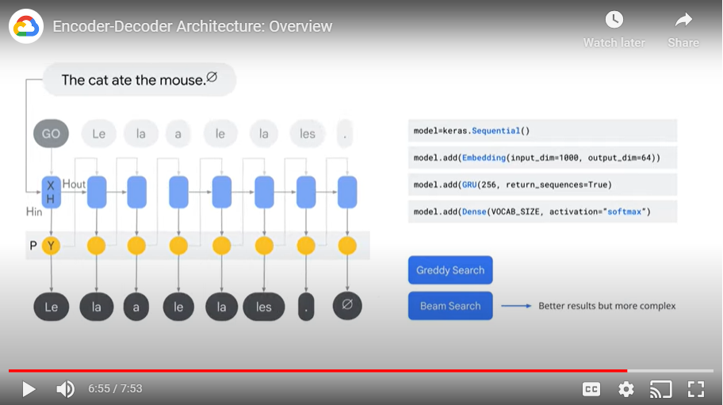

# Notes

## About
- Lector: Benoit Dherin, Machine Learning Engineer, Advanced Solutions Lab, Google Cloud
- Contents of the course:
    - Encoder-Decoder Architecture
    - The training phase
    - The serving phase
    - 

## E-D c:
- The encoder-decoder architecture is a sequence-to-sequence architecture
    - The encoder-decoder architecture is machine that consumes sequences and spits out sequences.
    - Example: input is a sequence of words “The cat ate the mouse”, output is the translation in French “Le chat a mange la souris”
    - Example 2: the sequence of words forming the prompt sent to a large language model; the output is the response of the large language model to this prompt

# E-D stages
- 
- Stage 1: an encoder stage
    - Produce a vector representation of the input sentence
    - 
- Stage 2: a decoder stage
    - Create the sequence output
    - 
- Both the encoder and the decoder can be implemented with different internal architectures.
    - The internal mechanism can be a recurrent neural network or a more complex transformer block as in the case of the super powerful language models we see nowadays

# The training phase
- To train a model, you need a dataset, that is a collection of input/ouput pairs that you want your model to imitate
- Then feed this dataset to the model, which will correct its weights during training on the basis of the error it produces on a given input in the dataset
- This error is essentially the difference between what the neural network generates given an input sequence and the true output sequence you have in your dataset

# The serving phase
- 
- After training, at serving time, when you want to say generate a new translation or a new response to a prompt, You’ll start by feeding the encoder representation of the prompt to the decoder along with a special token like “GO”
    - This will prompt the decoder to generate the first word. 
