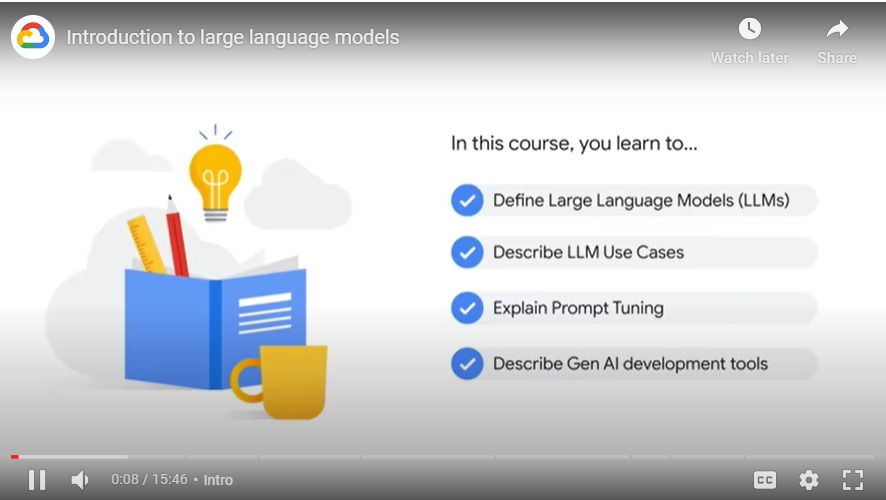
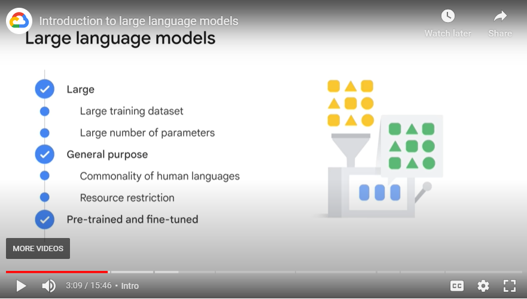
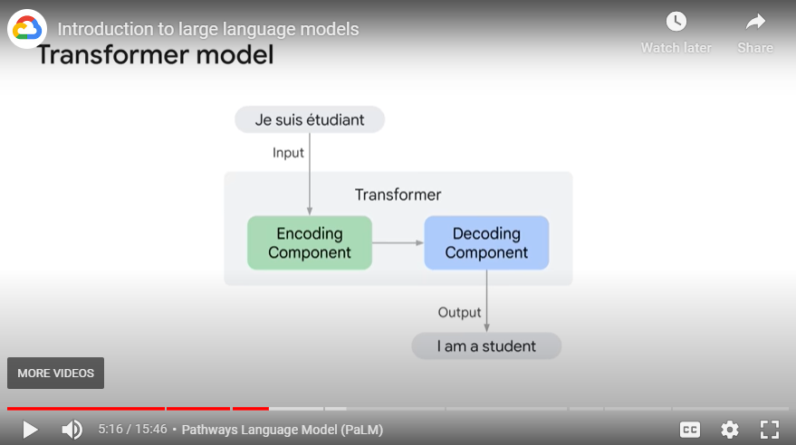
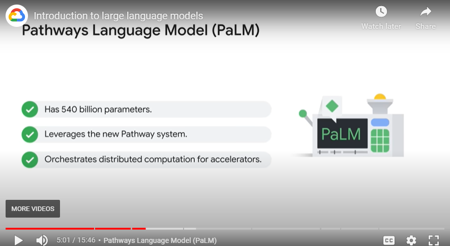
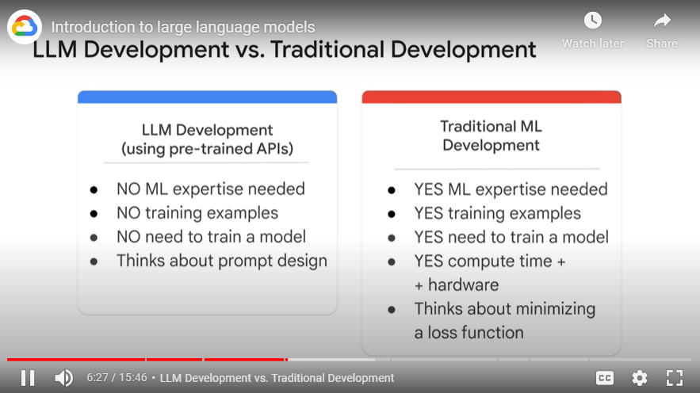
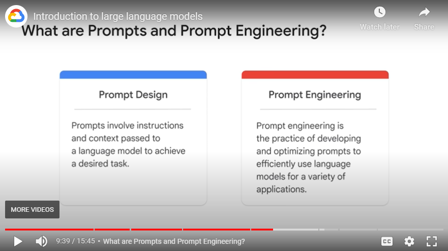
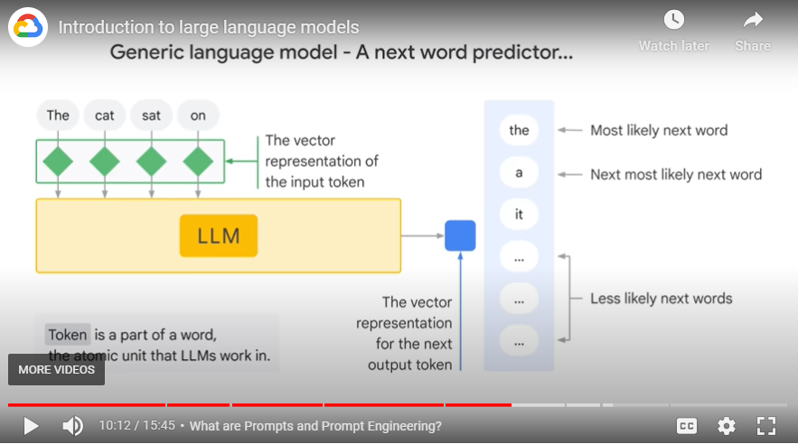
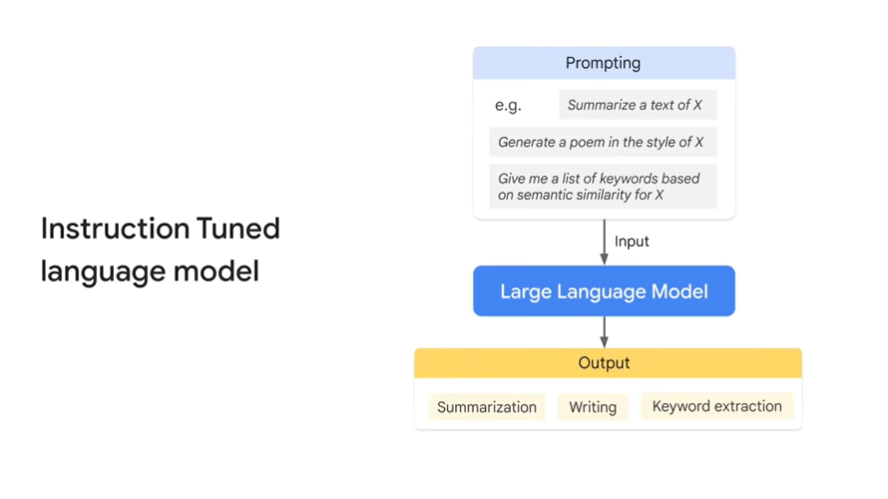
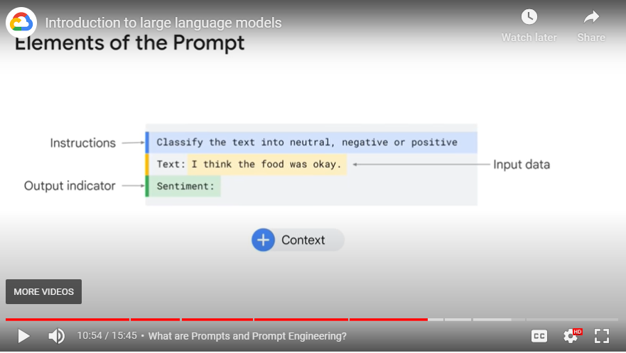
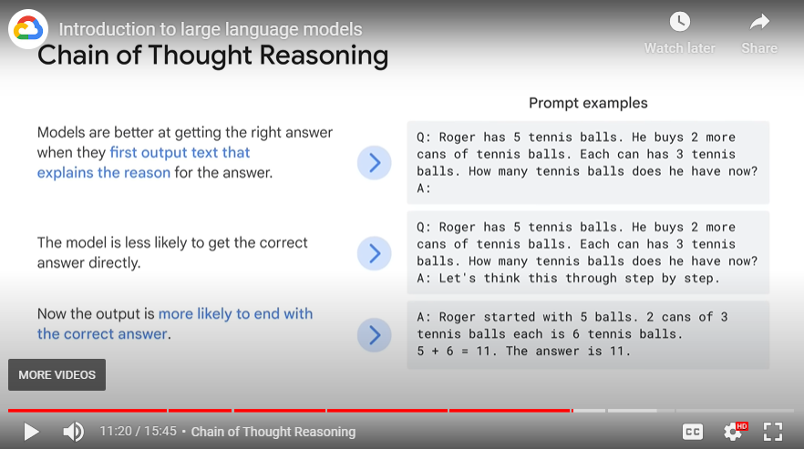

# Notes

## About
- Lector: John Ewald, Training Developer, Google Cloud
- Contents of the course:
    - Define Large Language Models (LLMs)
    - Describe LLM Use Cases
    - Explain Prompt Tuning
    - Describe Gen AI development tools
    - 

## About LLMs
- LLM is a Large, General-purpose language model, that can be pre-trained and then fine-tuned for specific purposes
    - pre-train = LLMs are trained to solve common language problems, like text classification, question answering, document summarization, text generation across industries
    - fine-tune = The models can then be tailored to solve specific problems in different fields, like retail, finance and entertainment using a relatively small size of field datasets
- x3 major features of LLMs:
    - Large: enormous size of training dataset, petabyte scale; large number of parameters
    - General purpose: models are sufficient to solve common problems
    - Pre-trained & fine-tuned: to pretrain a LLM for a general purpose with a large dataset and then fine-tune it for specific aims with a much smaller dataset
    - 

# Benefits of using LLM
1. A single model can be used for different tasks
2. The fine-tune process requires minimal field data
    - LLMs obtain decent performance even with little domain data = can be used for few/zero-shot scenarios
3. The performance is continuously growing with more data and parameters

# PaLM by Google
- PaLM = Pathways Language Model
    - Dense, decoder-only transformer model
        - 
    - Has 540 bln parameters
    - Leverages the new Pathway system = enables Google to train model with multiple TPU pods
        - Pathway = new AI architecture
    - The system enables PaLM to orchestrate distributed computation for accelerators
    - 

# LLM development VS Traditional ML development
- LLM development (using pre-trained APIs):
    - No ML expertise needed
    - No need for training examples
    - No need to train a model
    - All you need: Think about prompt design - a process of creating a prompt, that is clear, concise and informative
- Traditional ML development:
    - ML expertise needed
    - training examples needed
    - need to train a model
    - takes compute time + hardware
    - thinks about minimizing a loss function
- 

# Prompts
- Prompt design is the process of creating prompts that elicit the desired response from a language model
- Prompt design - is the process of creating a prompt tailored to the specific task that the system is being asked to perform.
- Prompt engineering - is the process of creating a prompt designed to improve performance, which may involve using domain-specific knowledge, providing examples of a desired output, or using specific keywords effective for the specific system.
- 

# Kinds of LLMs
There are x3 main kinds of LLM, each needs prompting in a different way!
1. Generic (oor Raw) Language Models
    - these predict the next word (token) based on the language in the training data
    - think of this kind like an autocomplete for a search
    - 
2. Instruction Tuned
    - trained to predict a response to the instructions given in the input
    - example: summarize a text of X; generate a poem in the style of X
    - 
    - 
3. Dialog Tuned
    - trained to have a dialog by predicting the next response
    - Dialog-tuned models are a special case of instruction tuned where requests are typically framed as questions to a chat bot

# Chain of Thought Reasoning
- CoTR is an observation that models are better at getting the right answer when they first output text that explains the reason for the answer.
- 

# Tuning LLMs
- Parameter-Efficient Tuning Methods (PETM) - methods for tuning an LLM on your own custom data without duplicating the model.
    - The base model itself is not altered
    - A small number of add-on layers are tuned, which can be swapped in and out at inference time
- Prompt tuning = one of the easiest PETM
