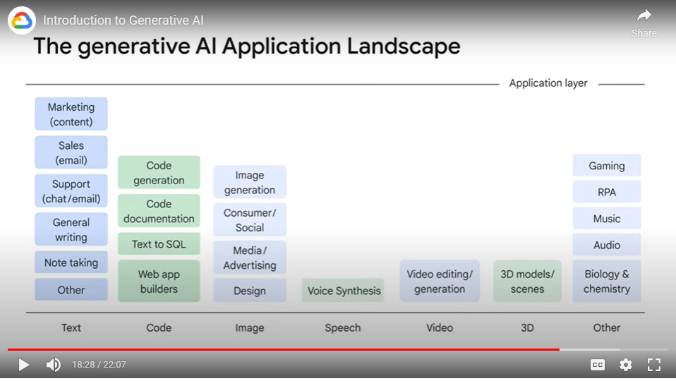

# Notes

## About
- Lector: Dr. Gwendolyn Stripling, Artificial Intelligence Technical Curriculum Developer, Google Cloud
- Contents of the course:
    - Define GenAI
    - Explain how GenAI works
    - Describe GenAI model types
    - Describe GenAI applications
    - 

## AI, ML, DL, Generative AI
- AI != ML
- **AI** is a branch of computer science that deals with the creation of intelligent agents, which are systems that can reason, learn, and act autonomously
    - AI is a discipline, like physics
    - AI deals with the theory and development of computer systems which are able to **perform tasks normally requiring human intelligence** = think and act like humans
- **ML** is a program or system that trains a model from input data.
    - The trained model can make useful predictions from new (never-before-seen) data drawn from the same one used to train the model.
    - ML gives the computer the ability to learn without explicit programming.
    - ML is a subfield of AI, ML < AI
- 
- **Deep Learning** is a type of machine learning that uses artificial neural networks, allowing them to process more complex patterns than machine learning.
    - Artificial neural networks are inspired by the human brain. They are made up of many interconnected nodes, or neurons, that can learn to perform tasks by processing data and making predictions
    - Deep learning models typically have many layers of neurons, which allows them to learn more complex patterns than traditional machine learning models.
    - Neural networks can use both labeled and unlabeled data = semi-supervised learning.
        - use small amount of labeled data & large amount of unlabeled data
        - use of labeled data: help the NN to learn the basic concepts of the task
        - use of unlabeled data: help the NN to generalize to new examples
    - DL is subset of ML - as shown in the visualization: 
        - 
- **Generative AI** is a type of AI technology that can produce various types of content: text, imagery, audio, synthetic data
    - Generative AI is a **subset of Deep Learning**, GenAI < Deep Learning
    - 
    - Large Language Models (LLMs) are also a subset of Deep Learning, LLMs < Deep Learning
    - 
    - GenAI uses NN, can process both labeled and unlabeled data, using supervised, unsupervised, and semi-supervised methods
    - The responses which GenAI outputs are based on all the massive large data the model was already trained on
    - Examples of LLMs:
        - PaLM (or Pathways Language Model)
        - LaMDA (or Language Model for Dialogue Applications)
        - GPT
- What was the way of progress:
    - Step 1: Traditional programming - hard code the rules for distinguishing a cat - type: animal, legs: 4, ears: 2, fur: yes, likes: yarn, catnip
    - Step 2: Neural networks - give the network pictures of cats and dogs and ask - “Is this a cat” - and it would predict a cat
    - Step 3: we - as users - can generate our own content - whether it be text, images, audio, video, etc
    - 

## Supervised ML VS Unsupervised ML
- There are x2 common types of ML:
    1. Unsupervised ML models
        - implies the data is **not labeled**
        - unsupervised problems are all about looking at the raw data, and seeing if it naturally falls into groups
        - example: clustering = group unlabeled data points
    2. Supervised ML models.
        - implies the data is **already labeled**
        - in supervised learning we are learning from past examples to predict future values
        - example: you are the owner of a restaurant. You have historical data of the bill amount and how much different people tipped based on order type - pick-up or delivery. The task: predict the future tip amount based on whether an order was picked-up or delivered
- Supervised vs Unsupervised schematically:
    - 
    - Note: in supervised learning, the model outputs a prediction AND solves some kind of optimization problem (comparing predicted values with actual values), reducing the error until predicted and actual values are closer

## Deep Learning Model types:
- Deep learning models (or machine learning models in general) can be divided into two types – generative and discriminative
    - 
- Discriminative model is a type of model that is used to classify or predict labels for data points
    - are typically trained on a dataset of labeled data points
    - they learn the relationship between the features of the data points and the labels.
    - Once a discriminative model is trained, it can be used to predict the label for new data points
    - example: given a picture, classify as a dog or a cat
- Generative model is a type of model that generates new content
    - it generates new data instances based on a learned probability distribution of existing data
    - example: given a picure, generate dog image

## Predictive ML model VS GenAI model
- Predictive ML model:
    - learns relationship between data and label
    - outputs a label: number, discrete, class, probability
    - example: predicting sales
- GenAI model:
    - learns patterns in unstructured content
    - outputs new content: natural language, image, audio
    - example: sentence "Define sales", as the question would elicit a text response
- 
- 

## Generative AI: definition
- GenAI is a type of Artificial Intelligence that creates new content based on what it has learned from existing content.
    - 
- The process of learning from existing content is called training and results in the creation of a statistical model.
    - It learns the underlying structure of the data and can then generate new samples that are similar to the data it was trained on.
- When given a prompt, GenAI uses this statistical model to predict what an expected response might be–and this generates new content.
- Types of GenAI based on data:
    - A generative language model can take what it has learned from the examples it’s been shown and create something entirely new based on that information. Hence the word “generative!”
        - 
    - A generative image model takes an image as input and can output text, another image, or video
        - 

## Generative language models
- GenLM learn about patterns in language through training data
- Then, given some text, they predict **what comes next**
    - That means generative language models are pattern-matching systems = They learn about patterns based on the data you provide
- How does GLM work:
    - 
- Hallucinations in GLMs are words or phrases that are generated by the model that **are often nonsensical or grammatically incorrect**
    - Hallucinations can be caused by a number of factors:
        - the model is not trained on enough data
        - the model is trained on noisy or dirty data
        - the model is not given enough context
        - the model is not given enough constraints
    - Problem: hallucinations can make the output text difficult to understand. They can also make the model more likely to generate incorrect or misleading information.
    - How to fix:
        - train the model on more
        - train the model on cleaner data
        - give the model more context or more constraints
- The applications of GenAI:
    - 

## Prompting
- A prompt is a short piece of text that is given to the LLM as input, and it can be used to control the output of the model in a variety of ways.
- Prompt design is the process of creating a prompt that will generate the desired output from a large language model (LLM).
    - 

## Types of models
- Foundation model A foundation model is a large AI model pre-trained on a vast quantity of data "designed to be adapted” (or fine-tuned) to a wide range of downstream tasks
    - 
- Text-to-Text
    - take a natural language input and produce text output
    - These models are trained to learn the mapping between a pair of texts (e.g. translation from one language to another).
    - 
- Text-to-Image
    - Text-to-image models are trained on a large set of images, each captioned with a short text description
    - Diffusion is one method used to achieve this.
    - 
- Text-to-video and Text-to-3D
    - Text-to-video models aim to generate a video representation from text input
    - The input text can be anything from a single sentence to a full script
    - The output is a video / three-dimensional objects that correspond to a user’s text description
    - 
- Text-to-task
    - Text-to-task models are trained to perform a defined task or action based on text input
    - This task can be a wide range of actions such as answering a question, performing a search, making a prediction, or taking some sort of action
    - 

## Google products & tools
- Generative AI Studio - explore and customize generative AI models that you can leverage in your applications on Google Cloud
- Generative AI App Builder - lets you create Gen AI apps without having to write any code
- PaLM API: let’s you test and experiment with Google’s Large Language Models and Gen AI tools
- MakerSuite - an approachable way to start prototyping and building generative AI applications
