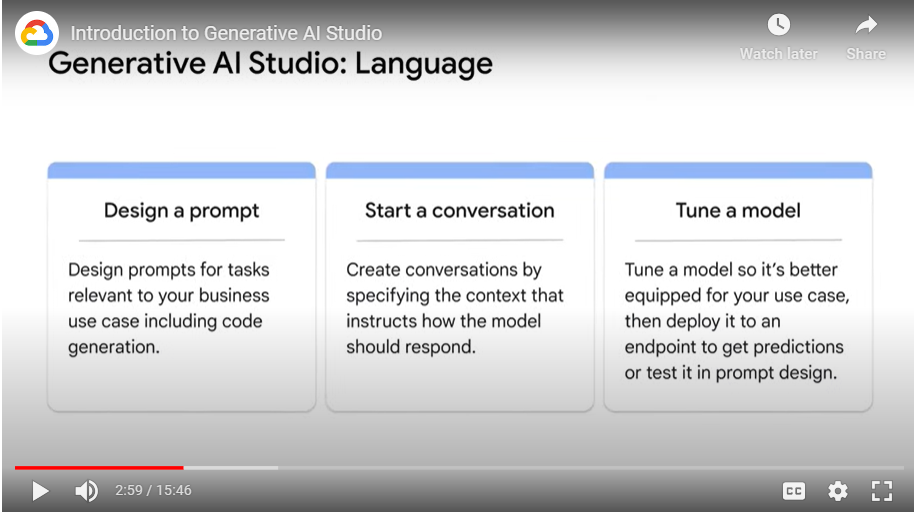

# Notes

## About
- Agenda:
    - Explain what Generative AI Studio does
    - Describe Generative AI Studio options
    - Explore the Generative AI Studio language model
    - 

## Google's part
- Google Cloud provides several easy-to-use tools that help you use generative AI in your projects with or without an AI and machine learning background.
- One such tool is Vertex AI.

## Vertex AI
- https://cloud.google.com/vertex-ai
- Vertex AI is an end-to-end ML development platform on Google Cloud that helps you build, deploy, and manage machine learning models
    - 

## Model Garden
- If you are a data scientist or ML developer who wants to build and automate a generative AI model, you can start from Model Garden
- Model Garden lets you discover and interact with Google’s foundation and third-party open source models and has built-in MLOps tools to automate the ML pipeline.

## Generative AI Studio
- With Vertex AI, if you are an app developer or data scientist and want to build an application, you can use Generative AI Studio to quickly prototype and customize generative AI models with no code or low code
- Generative AI Studio supports language, vision, and speech.
    - 
    - The list grows as you are learning this course :)
- What one can do with language tasks:
    - 

## X-shot prompting
- Zero-shot prompting - is a method where the LLM is given no additional data on the specific task that it is being asked to perform. Instead, it is only given a prompt that describes the task.
- One-shot prompting - is a method where the LLM is given a single example of the task that it is being asked to perform.
- Few-shot prompting - is a method where the LLM is given a small number of examples of the task that it is being asked to perform.
- 

## Prompting parameters
- 
- 
- 
- 

## Parameter-efficient tuning
- 
- PET is available at Vertex AI!
    - 
