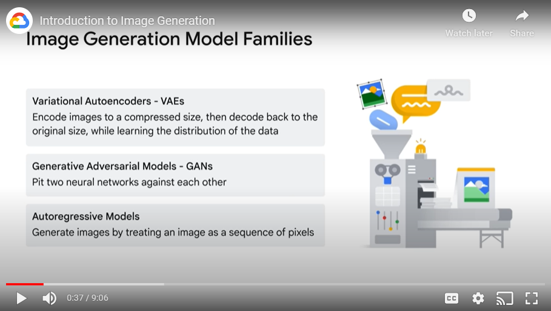
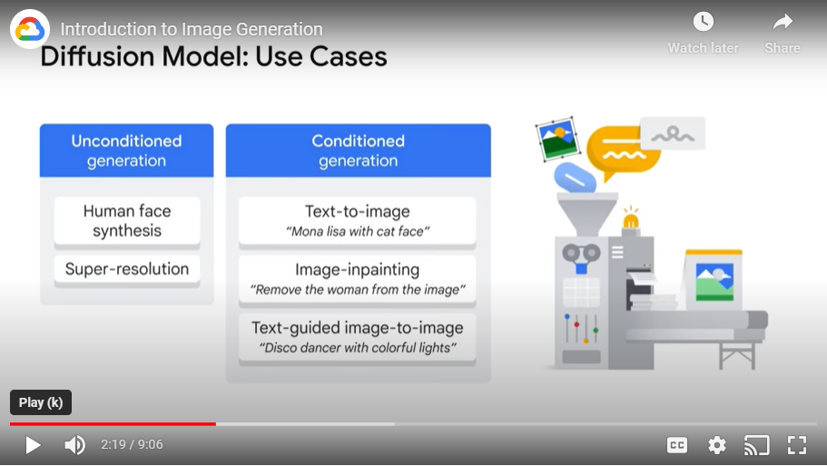
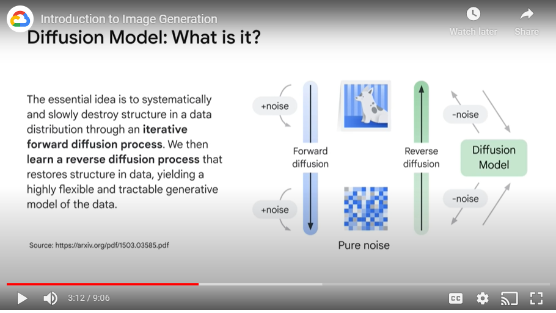
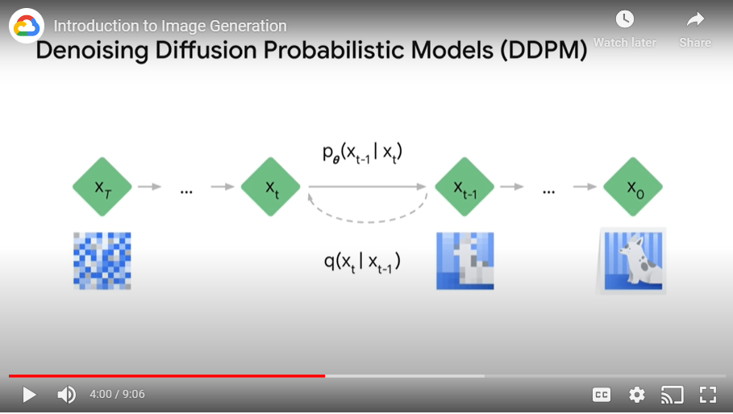
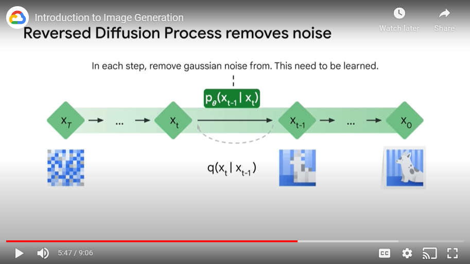
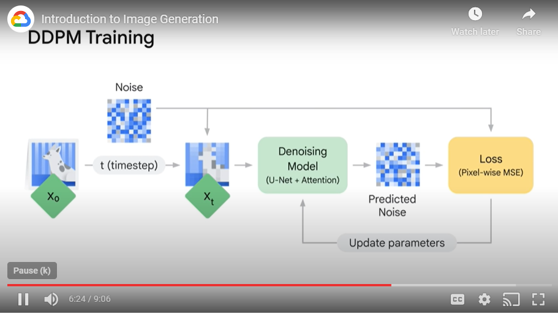
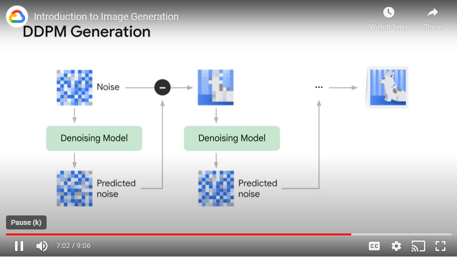

# Notes

## About
- Lector: Kyle Steckler, Machine Learning Engineer, Advanced Solutions Lab, Google Cloud
- Contents of the course:
    - Provide an introduction to diffusion models

## Image Generation Model Families
- Most promising/popular ones:
    1. Variational Autoencoders - VAEs
        - Encode images to a compressed size, then decode back to the original size, while learning the distribution of the data itself
    2. Generative Adversarial Models - GANs
        - Pit two neural networks against each other
        - One neural network, the generator creates images
        - Other neural network, the discriminator predicts, if the image is real or fake
        - Over time, the discriminator gets better and better at distinguishing between real and fake, and the generator gets better and better at creating real looking fakes.
    3. Autoregressive Modeles
        - Generate images by treating an image as a sequence of pixels
        - The modern approach with auto regressive models actually draws much of its inspiration from how LLM’s handle text.
    - 

## Diffusion models
- Diffusion models underpin many of the state of the art image generation systems that you may be familiar with today
- Diffusion models draw their inspiration from physics, specifically thermodynamics
- Use cases:
    - 
    - Unconditioned diffusion models, where models have no additional input or instruction, can be trained from images of a specific thing, such as faces, and it will learn to generate new images of that thing

## Diffusion model: what is it?
- Idea: the model is able to learn the real data distribution of images that it's seen and then sample from that learn distribution to create new novel images
- The essential idea is to systematically and slowly destroy structure in a data distribution through an iterative forward diffusion process
    - adding noise iteratively to an image & restore structure in the data
- 
- 
- 
- 
- 

## Imagen
https://imagen.research.google/
