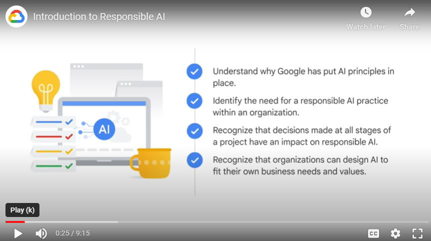
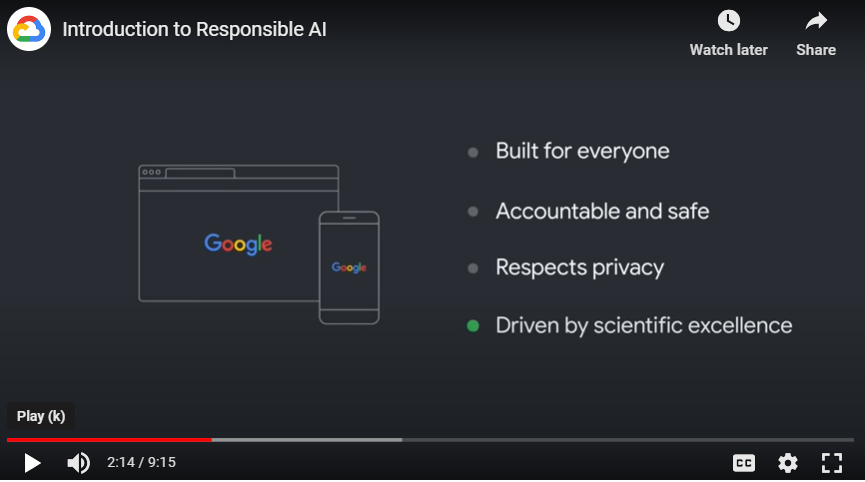

# Notes

## About
- Contents of the course:
    - Understand why Google has put AI principles in place.
    - Identify the need for a responsible AI practice within an organization.
    - Recognize that decisions made at all stages of a project have an impact on responsible AI.
    - Recognize that organizations can design AI to fit their own business needs and values.
    - 

## Responsible AI
- Note: AI is not infallible!
- Developing responsible AI requires an understanding of the possible issues, limitations, or unintended consequences
- For now, there is not a universal definition of “responsible AI,” nor is there a simple checklist or formula that defines how responsible AI practices should be implemented.
- Instead, organizations are developing their own AI principles, that reflect their mission and values. 

## Responsible AI at Google
- Our approach to responsible AI is rooted in a commitment to strive towards AI:
    1. that is built for everyone
    2. that is accountable and safe
    3. that respects privacy,
    4. that is driven by scientific excellence.
- 
- Guys at Google developed their own AI principles, practices, governance processes, and tools that together embody Google's values and guide their approach to responsible AI.
- It is important to incorporate responsibility by design into products & into organization
- Every decision point requires consideration and evaluation to ensure that choices have been made responsibly from concept through deployment and maintenance.
- Building responsibility into any AI deployment makes better models and builds trust with our customers and our customers’ customers
    - If at any point that trust is broken, we run the risk of AI deployments being stalled, unsuccessful, or at worst, harmful to stakeholders those products affect.

# 7 AI principles by Google
- These principles are concrete standards that actively govern our research and product development and affect our business decisions.
- Principles:
    1. AI should be socially beneficial
        - Any project should take into account a broad range of social and economic factors and will proceed only where we believe that the overall likely benefits substantially exceed the foreseeable risks and downsides
    2. AI should avoid creating or reinforcing unfair bias
        - We seek to avoid unjust effects on people, particularly those related to sensitive characteristics such as race, ethnicity, gender, nationality, income, sexual orientation, ability, and political or religious belief
    3. AI should be built and tested for safety
        - We will continue to develop and apply strong safety and security practices to avoid unintended results that create risks of harm.
    4. AI should be accountable to people
        - We will design AI systems that provide appropriate opportunities for feedback, relevant explanations, and appeal. 
    5. AI should incorporate privacy design principles
        - We will give opportunity for notice and consent, encourage architectures with privacy safeguards, and provide appropriate transparency and control over the use of data.
    6. AI should uphold high standards of scientific excellence
        - We will work with a range of stakeholders to promote thoughtful leadership in this area, drawing on scientifically rigorous and multidisciplinary approaches. And we will responsibly share AI knowledge by publishing educational materials, best practices, and research that enable more people to develop useful AI applications.
    7. AI should be made available for uses that accord with these principles
        - Many technologies have multiple uses, so we’ll work to limit potentially harmful or abusive applications.

# Google AI applications Google won't pursue
1. Technologies that cause or are likely to cause overall harm
2. Weapons or other technologies whose principal purpose or implementation is to cause or directly facilitate injury to people
3. Technologies that gather or use information for surveillance that violates internationally accepted norms
4. Technologies whose purpose contravenes widely accepted principles of international law and human rights
