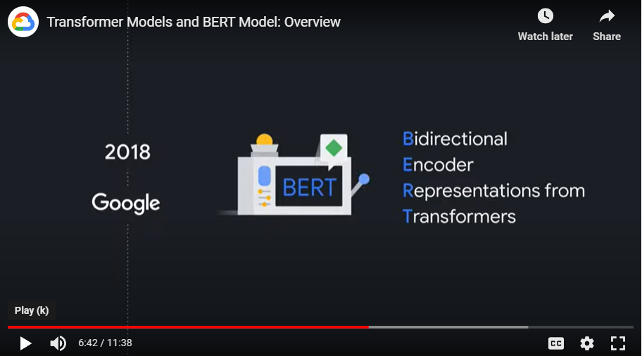

# Notes

## About
- Lector: Sanjana Reddy, Machine Learning Engineer, Advanced Solutions Lab, Google Cloud
- Objective: give you a solid footing on some of the underlying concepts that make all the Gen AI magic possible.

## Transformers
- A transformer is an encoder-decoder model that uses the attention mechanism.
    - It can take advantage of pluralization and also process a large amount of data at the same time.
    - 
    - 
    - 
- Transformers is based on a 2017 paper named Attention As All You Need
    - https://arxiv.org/abs/1706.03762
- Although all the models before Transformers were able to represent words as vectors, these vectors did not contain the context
    - Example: bank and river bank versus bank in bank robber might have the same vector representation before attention mechanisms came about.
    - 

## BERT overview
- 
- 
- BERT (Bidirectional Encoder Representation from Transformers) is encoder-only architecture by Google
    - Today, BERT powers Google Search
- 
    - Variations of BERT: BERT Base and BERT Large
        - 
    - The Bert model is powerful because it can handle long input context
    - BERT works at both a sentence level and at a token level.
- BERT was trained on two different tasks:
    1. masked language model - predict the masked words
        - 
    2. predict the next sentence - learn the relationships between sentences and predict the next sentence given the first one
        - 
